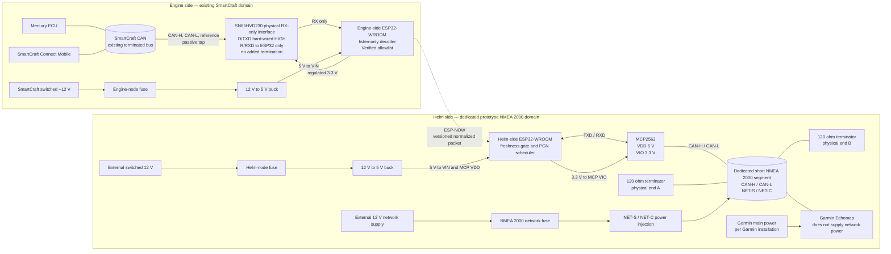

# Architecture Overview

## Master architecture diagram

This is the subsystem's authoritative architecture diagram. Other documents reference it rather than maintaining competing sketches.

## Separation of responsibilities

| Domain | Responsibility | Must not do |
|---|---|---|
| SmartCraft source analysis | Establish CAN IDs, pages, fields, scaling and evidence status | Depend on gateway assumptions |
| Engine node | Listen, decode Verified values, normalize and publish | Drive or acknowledge SmartCraft CAN |
| ESP-NOW link | Carry versioned snapshots with freshness metadata | Promote Unknown values to valid data |
| Helm node | Validate packets, enforce stale handling and schedule NMEA output | Reconstruct missing values as zero |
| Prototype NMEA segment | Carry gateway-generated NMEA traffic to Garmin | Electrically bridge to SmartCraft CAN |

## Trust boundaries

- SmartCraft and NMEA 2000 are separate CAN electrical domains. No CAN frame forwarding or wire-level bridge exists.
- The wireless packet is the only data path between nodes.
- Engine-side decoded values cross the boundary only when authorized by [`SMARTCRAFT_INPUT_CONTRACT.md`](SMARTCRAFT_INPUT_CONTRACT.md) and the source frame is fresh.
- Helm-side NMEA messages are derived data. Their PGN selection remains Candidate until verified on the Garmin target.

## Data path

1. SN65HVD230 receives SmartCraft differential traffic.
2. ESP32 TWAI operates in listen-only mode and validates DLC, ID/page and payload bounds.
3. Decoder allowlist produces normalized integer values and per-signal validity.
4. Snapshot publisher adds boot ID, sequence and monotonic source time.
5. Helm node rejects malformed, duplicate, old-version or out-of-window packets.
6. Fresh eligible values are converted to the selected NMEA library's units.
7. NMEA scheduler transmits only on the dedicated segment.

## Failure behavior

| Failure | Required behavior |
|---|---|
| Engine firmware crash | SmartCraft remains physically recessive because TX is not wired and transceiver D is fixed HIGH |
| Engine-node power loss | Node disappears without adding termination; unpowered-bus loading must pass bench verification |
| ESP-NOW loss | Helm marks data stale; stale PGNs are suppressed or use library-defined unavailable values |
| Sequence reset | New boot ID starts a new epoch; previous samples are discarded |
| Helm firmware crash | SmartCraft is unaffected because there is no electrical bridge |
| NMEA wiring fault | Separate fuse and CAN domain limit impact to the prototype segment |

## Evidence status

- Two-node topology and physical separation: **Architectural decision**.
- RPM, engine temperature and engine-runtime inputs: authorized by [`SMARTCRAFT_INPUT_CONTRACT.md`](SMARTCRAFT_INPUT_CONTRACT.md), version 1.0.0.
- Oil-pressure CAN field, fuel rate, engine load and battery-voltage mappings: **not Verified for gateway output**.
- Candidate NMEA PGNs and Garmin display behavior: **Candidate/TBD** pending bench and target-device tests.

## Primary hardware references

- TI SN65HVD23x datasheet: https://www.ti.com/lit/ds/symlink/sn65hvd230.pdf
- Microchip MCP2562 product page: https://www.microchip.com/en-us/product/MCP2562
- Espressif ESP-NOW API: https://docs.espressif.com/projects/esp-idf/en/v5.2/esp32/api-reference/network/esp_now.html
- Garmin NMEA 2000 technical reference: https://www8.garmin.com/manuals/webhelp/GUID-1415AAD0-FE63-42A6-8F8D-DB713D616122/EN-US/Technical_Reference_for_Garmin_NMEA_2000_Products_EN-US.pdf

