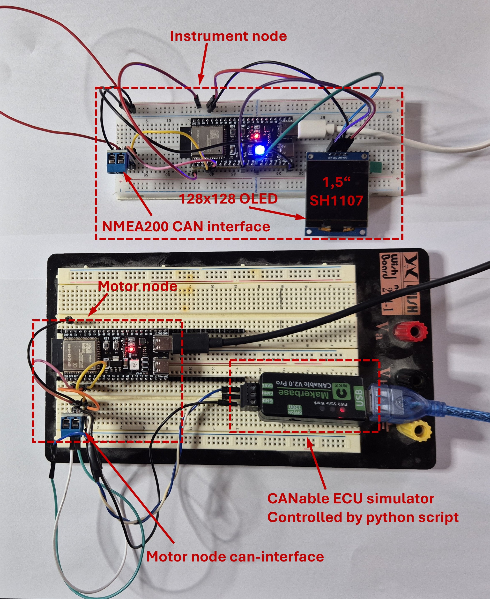

# CraftBridge mockup parts list

This page lists the actual development/mockup components used for the CraftBridge bench setup shown below.

The AliExpress links below are intended to point to the same component types used during development and testing.

This is **development hardware only**.

It is **not** the final CraftBridge PCB, production BOM, production wiring harness or permanent marine installation.

---

## Motor Node

### ESP32-S3 development board

The Motor Node uses an ESP32-S3 development board.

Required configuration:

- ESP32-S3-WROOM-1
- N16R8
- 16 MB Flash
- 8 MB PSRAM
- USB-C

Used for:

- SmartCraft CAN communication
- local Web interface
- ESP-NOW transmission to the Instrument Node

AliExpress:

[ESP32-S3 N16R8 development board](https://www.aliexpress.com/item/1005012669680031.html?spm=a2g0o.order_list.order_list_main.49.580f1802OJ2phS)

---

### CAN transceiver module

The Motor Node requires a CAN transceiver between the ESP32-S3 and the SmartCraft CAN bus.

The ESP32 GPIO pins must **never** be connected directly to SmartCraft CAN-H or CAN-L.

The development setup uses a 3.3 V CAN transceiver module.

Current Motor Node firmware pins:

| Function | ESP32-S3 |
|---|---:|
| CAN TX | GPIO4 |
| CAN RX | GPIO5 |

Typical module connections:

| ESP32-S3 | CAN module |
|---|---|
| GPIO4 | TX / CTX |
| GPIO5 | RX / CRX |
| 3.3 V | VCC |
| GND | GND |

The CAN side of the module connects to:

- SmartCraft CAN-H
- SmartCraft CAN-L

AliExpress:

[3.3 V CAN transceiver module](https://www.aliexpress.com/item/1005006438437964.html?spm=a2g0o.order_list.order_list_main.44.580f1802OJ2phS)

---

## Instrument Node

### ESP32-S3 development board

The Instrument Node uses the same ESP32-S3 N16R8 development board as the Motor Node.

Using the same board for both nodes keeps the development setup simple and makes firmware development and testing easier.

Used for:

- ESP-NOW reception from the Motor Node
- local display
- future NMEA 2000 output

AliExpress:

[ESP32-S3 N16R8 development board](https://www.aliexpress.com/item/1005012669680031.html?spm=a2g0o.order_list.order_list_main.49.580f1802OJ2phS)

---

### NMEA 2000 CAN transceiver module

The Instrument Node uses a CAN transceiver for NMEA 2000 communication.

This is currently part of the development setup.

The final NMEA 2000 firmware is still under development.

As with the Motor Node, the ESP32 GPIO pins must not be connected directly to CAN-H or CAN-L.

AliExpress:

[3.3 V CAN transceiver module](https://www.aliexpress.com/item/1005006438437964.html?spm=a2g0o.order_list.order_list_main.44.580f1802OJ2phS)

---

### 1.5 inch OLED display

The display used in the current Instrument Node mockup is:

- 1.5 inch OLED
- 128 × 128 pixels
- SH1107 controller
- I2C
- address `0x3C`

Current Instrument Node connections:

| OLED | ESP32-S3 |
|---|---:|
| SDA | GPIO8 |
| SCL | GPIO9 |
| VCC | 3.3 V |
| GND | GND |

AliExpress:

[1.5 inch 128×128 SH1107 OLED display](https://www.aliexpress.com/item/4000049991220.html?spm=a2g0o.order_list.order_list_main.203.580f1802OJ2phS)

The display is used for development and local engine-data presentation.

The Instrument Node is intended to support both local display and NMEA 2000 output using the same firmware.

---

## CANable USB CAN adapter

The CANable adapter shown in the development bench picture is used as part of the CraftBridge ECU simulator setup.

It is controlled by the CraftBridge Python ECU simulator and generates SmartCraft CAN traffic for bench testing.

It is **not required for normal use of CraftBridge on a real engine**.

It can also be useful for:

- CAN logging
- protocol analysis
- bench testing
- troubleshooting

AliExpress:

[CANable compatible USB CAN adapter](https://www.aliexpress.com/item/1005009819657612.html?spm=a2g0o.order_list.order_list_main.95.580f1802OJ2phS)

---

# Minimum hardware for testing a Motor Node on a real engine

To test whether CraftBridge can read data from a SmartCraft-equipped Mercury engine, you do **not** need the complete bench setup.

The minimum hardware is:

1. ESP32-S3 N16R8 development board
2. 3.3 V CAN transceiver module
3. USB data cable
4. jumper wires or equivalent wiring
5. suitable connection to:
   - SmartCraft CAN-H
   - SmartCraft CAN-L
   - SmartCraft GND

You do **not** need:

- Instrument Node
- OLED display
- CANable ECU simulator

for a basic Motor Node compatibility test.

---

# SmartCraft connection

SmartCraft uses a CAN network.

The development setup must therefore respect:

- CAN-H / CAN-L polarity
- common ground
- correct bus topology
- correct termination

Do not add a 120 ohm termination resistor blindly to an existing SmartCraft installation.

A correctly installed SmartCraft network may already contain the required termination.

---

# Important electrical warning

Do **not** connect SmartCraft 12 V directly to an ESP32 development board.

For development and compatibility testing, the ESP32-S3 can be powered from USB while sharing ground with the SmartCraft CAN transceiver.

The final CraftBridge hardware will use a protected power supply designed for operation from the boat's electrical system.

AliExpress:

[DC-DC Buck Converter](https://www.aliexpress.com/item/1005008257960729.html?spm=a2g0o.order_list.order_list_main.54.580f1802OJ2phS)

---

# Motor Node CAN pins

Current Motor Node firmware:

| Signal | ESP32-S3 pin |
|---|---:|
| CAN TX | GPIO4 |
| CAN RX | GPIO5 |

These pins connect to the **logic side of the CAN transceiver**, not directly to the CAN bus.

---

# Instrument Node display pins

Current Instrument Node OLED configuration:

| Signal | ESP32-S3 pin |
|---|---:|
| SDA | GPIO8 |
| SCL | GPIO9 |

OLED I2C address:

`0x3C`

---

# Development status

This page documents the inexpensive mockup hardware used during CraftBridge development.

The following are not yet released:

- final CraftBridge PCB
- production BOM
- production wiring harness
- enclosure
- permanent marine installation instructions
- final Instrument Node / NMEA 2000 firmware

The mockup setup is intended for:

- development
- compatibility testing
- protocol analysis
- community testing

It is not intended as a finished marine installation.
