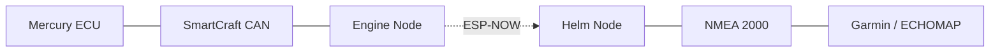

# Architecture and hardware

## System architecture

The wireless normalized-data link is the only path between the two CAN domains. Raw CAN frames are not forwarded.

## Engine Node

Responsibilities:

- interface with 250 kbit/s SmartCraft CAN;
- establish the documented standalone session when expanded pages are required;
- decode only explicitly supported ID/page/field combinations;
- attach validity, boot identity, sequence, and source time;
- transmit normalized snapshots over ESP-NOW.

The verified startup requires SmartCraft transmission, so the earlier passive-RX-only hardware concept is obsolete for a full standalone implementation. A final Engine Node design needs a bidirectional, 3.3 V-compatible CAN transceiver, correct standby control, no added termination on an already terminated SmartCraft network, and hardware/software controls that prevent arbitrary transmission. Exact transceiver, GPIOs, protection, and connector pinout are not yet released.

## Helm Node

Responsibilities:

- validate packet version, length, sequence, boot identity, and age;
- reject malformed, duplicate, out-of-order, or stale data;
- convert valid normalized values to NMEA 2000 units;
- schedule supported PGNs on a physically separate NMEA 2000 segment.

The candidate transceiver is an MCP2562 operated with `VDD = 5 V` and `VIO = 3.3 V`. Final component selection remains open.

## ESP-NOW data contract

The implementation should use a versioned fixed-width packet containing:

- protocol version and packet length;
- Engine Node boot ID and sequence number;
- monotonic source timestamp;
- validity/status mask;
- normalized integer values;
- integrity check.

A new boot ID starts a new sequence epoch. Link loss or stale source data makes affected values unavailable; it must never silently substitute zero. Channel, peer provisioning, encryption, retry policy, packet layout, and freshness thresholds remain implementation decisions and must be versioned.

## NMEA 2000 output

The planned initial destinations are:

| SmartCraft value | Candidate NMEA 2000 destination | Status |
|---|---|---|
| RPM | PGN 127488, Engine Parameters Rapid Update | Candidate; Garmin verification pending |
| Runtime | PGN 127489, Engine Parameters Dynamic | Candidate; field/library verification pending |
| Coolant temperature | PGN 127489, Engine Parameters Dynamic | Candidate; field/library verification pending |

Do not infer NMEA verification from a verified SmartCraft mapping. PGN field layout, units, source address, engine instance, product identity, transmission periods, unavailable-value representation, and Garmin presentation all require independent validation against the selected NMEA library and target device.

## Electrical topology

- SmartCraft and NMEA 2000 CAN-H/CAN-L conductors must never be connected together.
- Do not add a 120 ohm terminator at a tap on an already terminated SmartCraft network.
- A prototype NMEA 2000 segment needs exactly two 120 ohm end terminators; powered-down resistance should be approximately 60 ohms.
- NMEA 2000 `NET-S`/`NET-C` needs an external fused supply. Do not assume the Garmin powers the network.
- Each node needs a fused, transient-protected supply and suitable decoupling.
- A generic ESP32 board, buck module, or CAN breakout is not automatically marine-, ignition-, or transient-rated.

## Preliminary bill of materials

| Qty | Item | Status / note |
|---:|---|---|
| 2 | ESP32-WROOM development boards | Exact boards and GPIOs TBD |
| 1 | 3.3 V-compatible bidirectional CAN transceiver | Engine Node; final part and safety controls TBD |
| 1 | MCP2562 CAN transceiver | Helm Node candidate; `VDD 5 V`, `VIO 3.3 V` |
| 2 | Protected 12 V-to-5 V supplies | Marine/transient suitability TBD |
| 3 | Fuses and holders | Node branches plus NMEA network; ratings TBD |
| 2 | 120 ohm NMEA 2000 terminators | Required at physical ends |
| 1 | Non-destructive SmartCraft tap harness | Connector and pinout must be verified |
| as required | NMEA 2000 connectors, twisted pair, power wiring | Final topology dependent |
| as required | TVS, reverse-polarity protection, decoupling, enclosure | Select after electrical review |

## Failure behavior

| Failure | Required response |
|---|---|
| Engine Node reset or timeout | Stop SmartCraft TX; require a clean restart; no blind retry loop |
| Unexpected directed SmartCraft response | Abort the startup state machine |
| ESP-NOW loss | Mark data stale and suppress/unavailable affected PGNs |
| Helm Node failure | Must not affect SmartCraft because the CAN domains are isolated |
| NMEA fault | Separate fuse and CAN domain limit impact to the NMEA segment |

Do not connect a prototype to a live vessel until schematics, pinout, termination, idle-current loading, transceiver fail states, and power protection have passed bench review.
